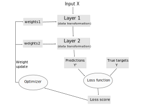
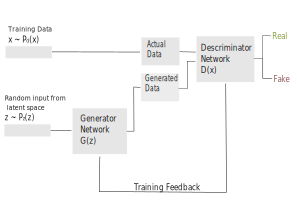
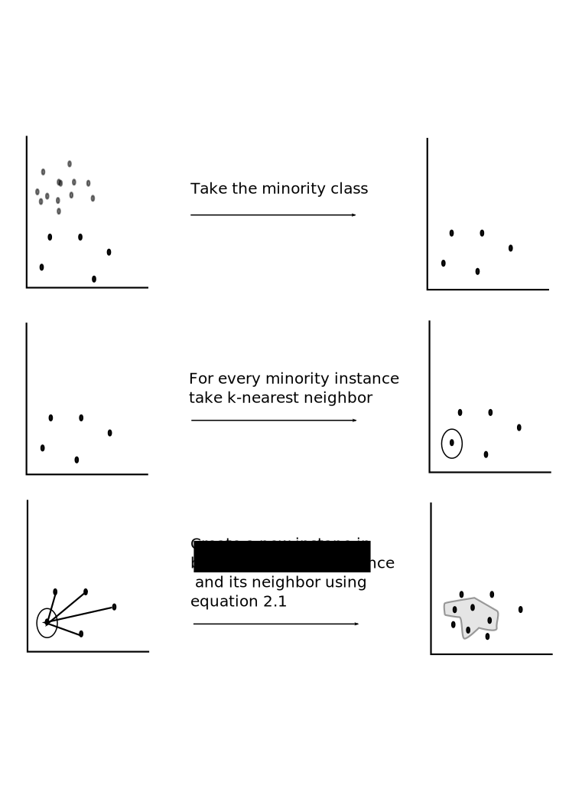
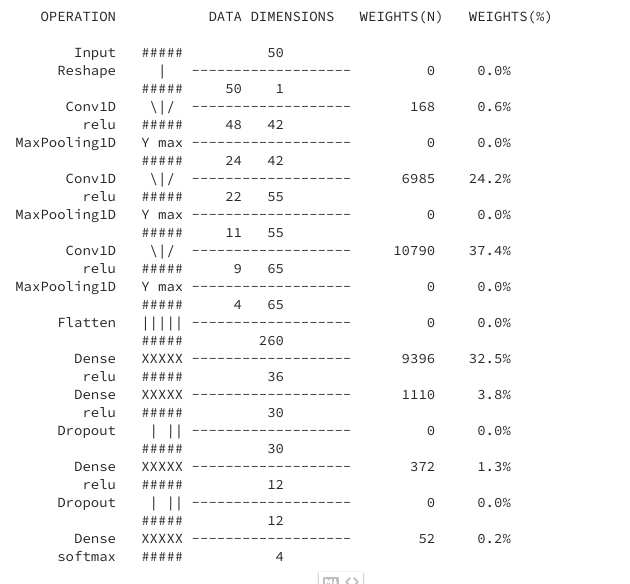
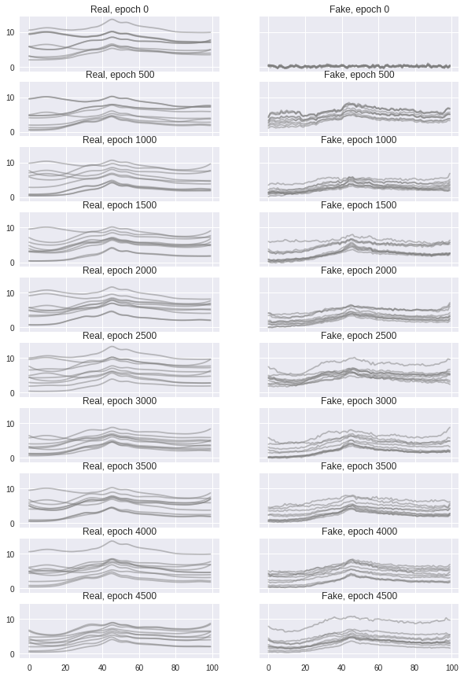
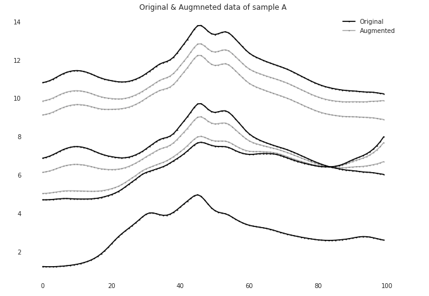

Aalto Master's Thesis 
=====
**Improving classification using augmentation**

## Thesis Template
- Adapted from the one found here: https://into.aalto.fi/pages/viewpage.action?pageId=6301918

- Remember to check the school, degree programme, major, city (campus), ... etc in the main file as well as in `aalto-thesis.sty` to ensure that they match your situation.

- See the **thesis.pdf** for the actual thesis

## Graphical Overview of key concepts described in thesis:

- Deep Learning 

- GANS Architecture

- Synthetic Minority Over Sampling(SMOTE)

- Classifier Network 

### Findings
- GAN augmentation process

- Augmentation using SMOTE

